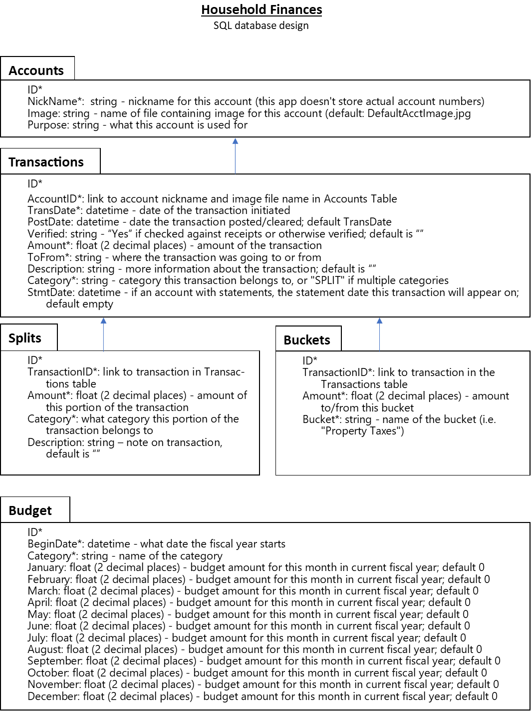

# HouseholdFinances
App for managing household finances.  Track transactions, verify balances, see total assets, create and track budget by categories, earmark portions of balance in some accounts using "buckets."

# Planned functions:

1. Import transactions from an Excel file to the database for multiple accounts
    1. Checking for duplicates (prompting to eliminate duplicates or to keep)
2. Track transactions by Category
3. Add and rename categories
4. Delete categories that have no transactions associated with them
5. Split a transaction by multiple categories
6. Note that a transaction has been verified against physical receipts
7. Note that a transaction has cleared
8. See an account by transaction date (to verify statement balances & transactions)
9. Manually enter transactions
10. Manually update transactions
11. See cleared balance, and total balance
12. See a snapshot of all accounts
13. See income / spending for all accounts by category
14. Allow for "buckets" in some accounts, where money is earmarked for specific purposes
    1. Ability to see buckets for the account
    2. Ability to move money from one bucket to another
    3. Ability to add, rename, delete buckets
15. Ability to assign values by month for each category
16. See year-to-date budget vs. actual by month

# SQL database
Required field is indicated by *.

## Accounts Table
1. ID*
2. Account*: string - nickname for the account (i.e. "Household checking")
3. TransDate*: datetime - date of the transaction initiated

## Transactions Table
1. ID*
2. AccountID*: - ID of the account in the Accounts table
3. TransDate*: datetime - date of the transaction initiated
4. PostDate: datetime   - date the transaction posted/cleared; default TransDate
5. Amount*: float (2 decimal places) - amount of the transaction
6. ToFrom*: string - where the transaction was going to or from
7. Description: string - more information about the transaction; default empty
8. Category*: string - category this transaction belongs to, or "SPLIT" if multiple categories
9. StmtDate: datetime - if an account with statements, the statement date this transaction will appear on; default empty

## Splits Table
1. ID*
2. TransactionID*: ID of transaction in Transactions table
3. Amount*: float (2 decimal places) - amount of this portion of the transaction
4. Category*: what category this portion of the transaction belongs to

NOTE: The total of the Amounts for all the entries of a given TransactionID should equal the corresponding Amount in the Transactions table.

## Buckets Table
1. ID*
2. TransactionID*: ID of transaction in the Transactions table
3. Amount*: float (2 decimal places) - amount to/from this bucket
4. Bucket*: string - name of the bucket (i.e. "Property Taxes")

NOTE:  One transaction from the Transactions table could have multiple entries in the Buckets table if the transaction is split among multiple buckets.  The total for each TransactionID should match the Amount in the Transactions table.

## Budget Table
1. ID*
2. BeginDate*: datetime - what date the fiscal year starts
3. Category*: string - name of the category
4. Jan: float (2 decimal places) - budget amount for this month in current fiscal year; default 0
5. Feb: float (2 decimal places) - budget amount for this month in current fiscal year; default 0
6. Mar: float (2 decimal places) - budget amount for this month in current fiscal year; default 0
7. Apr: float (2 decimal places) - budget amount for this month in current fiscal year; default 0
8. May: float (2 decimal places) - budget amount for this month in current fiscal year; default 0
9. Jun: float (2 decimal places) - budget amount for this month in current fiscal year; default 0
10. Jul: float (2 decimal places) - budget amount for this month in current fiscal year; default 0
11. Aug: float (2 decimal places) - budget amount for this month in current fiscal year; default 0
12. Sep: float (2 decimal places) - budget amount for this month in current fiscal year; default 0
13. Oct: float (2 decimal places) - budget amount for this month in current fiscal year; default 0
14. Nov: float (2 decimal places) - budget amount for this month in current fiscal year; default 0
15. Dec: float (2 decimal places) - budget amount for this month in current fiscal year; default 0

# Front end design

Draft of home page:

Clicking on "Home" will bring you to this page.

Clicking on "Assets" will bring you to the Assets page and associated functions.

Clicking on "Spending" will bring you to the Spending page and associated functions.

Clicking on "Budget" will bring you to the Budget page and associated functions.

Clicking on any of the accounts on the Home page will bring you to the corresponding Account Page.  Here is an example of that:

This project was bootstrapped with [Create React App](https://github.com/facebook/create-react-app).

## Available Scripts

In the project directory, you can run:

### `npm start`

Runs the app in the development mode. 
Open [http://localhost:3000](http://localhost:3000) to view it in the browser.

The page will reload if you make edits. 
You will also see any lint errors in the console.

### `npm test`

Launches the test runner in the interactive watch mode. 
See the section about [running tests](https://facebook.github.io/create-react-app/docs/running-tests) for more information.

### `npm run build`

Builds the app for production to the `build` folder. 
It correctly bundles React in production mode and optimizes the build for the best performance.

The build is minified and the filenames include the hashes. 
Your app is ready to be deployed!

See the section about [deployment](https://facebook.github.io/create-react-app/docs/deployment) for more information.

### `npm run eject`

**Note: this is a one-way operation. Once you `eject`, you can’t go back!**

If you aren’t satisfied with the build tool and configuration choices, you can `eject` at any time. This command will remove the single build dependency from your project.

Instead, it will copy all the configuration files and the transitive dependencies (webpack, Babel, ESLint, etc) right into your project so you have full control over them. All of the commands except `eject` will still work, but they will point to the copied scripts so you can tweak them. At this point you’re on your own.

You don’t have to ever use `eject`. The curated feature set is suitable for small and middle deployments, and you shouldn’t feel obligated to use this feature. However we understand that this tool wouldn’t be useful if you couldn’t customize it when you are ready for it.

## Learn More

You can learn more in the [Create React App documentation](https://facebook.github.io/create-react-app/docs/getting-started).

To learn React, check out the [React documentation](https://reactjs.org/).

### Code Splitting

This section has moved here: https://facebook.github.io/create-react-app/docs/code-splitting

### Analyzing the Bundle Size

This section has moved here: https://facebook.github.io/create-react-app/docs/analyzing-the-bundle-size

### Making a Progressive Web App

This section has moved here: https://facebook.github.io/create-react-app/docs/making-a-progressive-web-app

### Advanced Configuration

This section has moved here: https://facebook.github.io/create-react-app/docs/advanced-configuration

### Deployment

This section has moved here: https://facebook.github.io/create-react-app/docs/deployment

### `npm run build` fails to minify

This section has moved here: https://facebook.github.io/create-react-app/docs/troubleshooting#npm-run-build-fails-to-minify